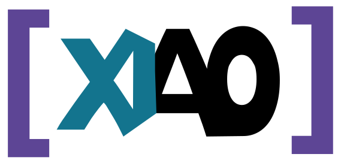

  

<h1 align="center">Hey, I'm Xiaolin Jin Lin 👋</h1>
<h3 align="center">Fullstack Developer • Frontend at UXLand • DevOps & Backend at TKM Consultores S.L.</h3>

---

### 👤 About Me

I'm a 27-year-old fullstack developer based in Barcelona. My passion for technology started early, and at 19 I committed fully to programming. I studied:

- **Multiplatform App Development (DAM)**
- **Web App Development (DAW)**  
  at *Centre d'Estudis Politècnics*, where I received the Outstanding Student award.

When I'm not coding, you'll probably find me dancing — a passion that taught me discipline, consistency, and focus, qualities I bring to every project.

I love working in teams, sharing knowledge, and creating solutions that bring real value.

### 🌍 Languages I Speak
- Spanish (Native)
- Catalan (Native)
- English (Intermediate)
- Chinese (Intermediate)

---

### 🚀 Tech Stack

#### 💻 Frontend

#### 💻 Backend

#### 📊 Databases

#### 🌐 Others

---

### 💻 My Portfolio

**📄 Portfolio OS Simulation**
> A portfolio that mimics an operating system: draggable windows, responsive layout, and playful UX.

Tech: **Vue.js**, **Bootstrap**, **Sass**

- 🔗 [Live Site](https://xiaojl.dev/)
- 💻 [GitHub Repo](https://github.com/x140l1n)

---

### 💼 Experience

####  Frontend Developer @ [UXLand](https://www.uxland.es)
**Nov 2024 – Present · Barcelona, Spain**
- Development of frontend architecture and components
- Contribution to design systems and microfrontends
- Worked with SAP, ABAP, Lit, React, Redux, Vite, Web Components, and more
- Integration with CI/CD, cloud, and enterprise solutions

**Technologies:**

---

####  Fullstack Developer / Helpdesk @ [TKM Consultores S.L.](https://www.tkmservicios.com)
**Nov 2019 – Present · Barcelona, Spain**
- Project planning, documentation, and development
- Web apps: HTML, CSS, JavaScript, PHP, Ruby on Rails, WordPress
- WinForms apps: .NET, .NET Core
- Database: SQL Server, MySQL, PostgreSQL
- Web server/hosting: Arsys, Axarnet, Guebs, CDMON
- Systems admin: Windows Server, AD, Exchange, Virtualization
- Networking: Routing, switching, firewall configuration
- Helpdesk: Support for end users, software/hardware maintenance
- ERP: Custom development and management using A3ERP

**Technologies:**

---

### 🎓 Education

#### Centre d'Estudis Politècnics (2021 - 2022) · Barcelona, Spain
**Web Application Development (DAW)**  
- Develop web applications with various frontend & backend frameworks  
- Database manipulation  
- Ubuntu server configuration  
- Project-based learning  
**Technologies:** HTML, CSS, Bootstrap, Sass, JS, Vue, React, Ionic, PHP, Laravel, Eloquent, MySQL  
**Grade:** 9

---

#### Centre d'Estudis Politècnics (2019 - 2021) · Barcelona, Spain
**Multiplatform Application Development (DAM)**  
- Develop desktop and Android applications with various programming languages  
- Game and BASH programming  
- Database manipulation  
- Project-based learning  
**Technologies:** Java, C#, C++, Android, WinForms .NET, ADO.NET, LIBGDX, SQL Server, MySQL  
**Grade:** 9

---

#### SOC CIFO Violeta (2018 - 2019) · Barcelona, Spain
**Object-Oriented Programming Certification (630h)**  
- Object-oriented programming  
- Operating systems and software applications  
- Relational databases  
**Technologies:**

**Grade:** 10

---

#### Instituto XXV Olimpiada (2014 - 2016) · Barcelona, Spain
**Technological Baccalaureate**

---

#### Instituto XXV Olimpiada (2010 - 2014) · Barcelona, Spain
**ESO**

---

### 🌐 Portfolio & Contact

---

Building with purpose. Growing every day. Open to collaboration 🚀
